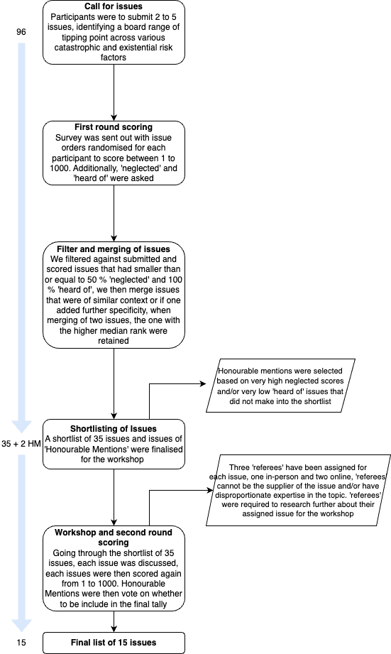
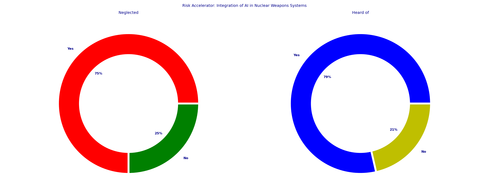
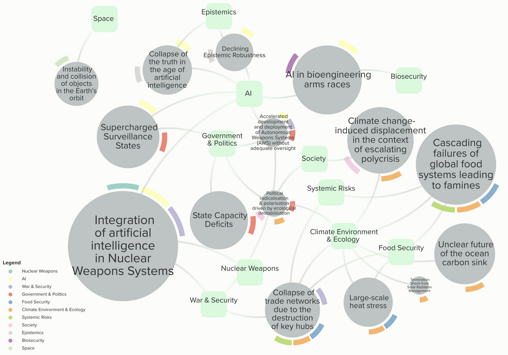
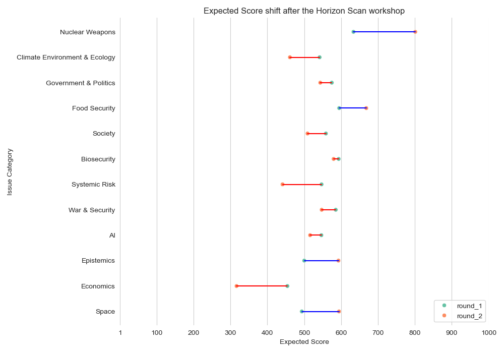
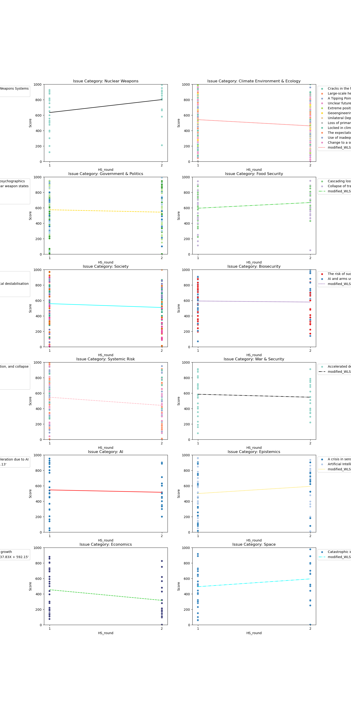

# Horizon Scan Project

## Overview

This project implements a structured horizon scanning methodology to systematically identify, assess, and prioritize emerging catastrophic and existential risks - events that could severely harm human civilization or cause human extinction. The system uses expert elicitation through multiple rounds of surveys, deliberation, and scoring to produce a prioritized list of the most important risks that deserve increased attention.



## What is a Horizon Scan?

A horizon scan is a systematic process for identifying emerging issues, trends, or risks that could have significant impact in the future. This methodology helps decision-makers anticipate and prepare for potential challenges by:

1. Gathering input from diverse experts across multiple disciplines
2. Scoring and prioritizing issues based on importance, neglectedness, and tractability
3. Facilitating deliberation to refine understanding and build consensus
4. Producing actionable outputs to guide research and policy priorities

## Project Structure

This project implements a reproducible analysis pipeline with three main stages:

1. **Data Processing**: Cleans and processes raw survey data from experts
2. **Data Science**: Analyzes the processed data using statistical models
3. **Reporting**: Generates visualizations and prioritized risk rankings

The data follows a structured workflow:
- Raw survey data → Intermediate processed data → Feature engineering → Model outputs → Visualizations

## Key Outputs

The project produces several key outputs:

1. **Prioritized Risk Lists**: Ranked lists of the most important catastrophic/existential risks
2. **Visualization Pie-Chart**: Pie charts showing score distributions, expert agreement levels, and risk categories



3. **Issue Network Maps**: Visualizes connections between related risk categories



4. **Deliberation Impact Analysis**: Measures how expert opinions shifted after workshop discussions



## Installation and Setup

### Prerequisites

- Python 3.8+
- Pip package manager

### Installation

```bash
# Clone the repository
git clone https://github.com/yourusername/horizon-scan.git
cd horizon-scan

# Install dependencies
conda env create -f environment.yml
pip install -r requirements.txt
```

To run specific pipeline stages, modify the configuration in `horizon_scan.yml`.

## Working with Notebooks

The repository includes several notebooks for exploratory data analysis and visualization:

```bash
jupyter notebook notebooks/
```

## Testing

Run the test suite with:

```bash
pytest
```

## Project Structure

```
├── conf/                  # Configuration files
├── data/                  # Data directories
│   ├── 01_raw/            # Raw input data
│   ├── 02_intermediate/   # Intermediate processed data
│   ├── 04_feature/        # Feature tables
│   └── 07_model_output/   # Output tables and files
├── docs/                  # Documentation and figures
│   └── figures/           # Generated visualizations
├── notebooks/             # Jupyter notebooks
├── src/                   # Source code
│   └── horizon_scan/      # Python package
│       └── pipelines/     # Pipeline code
└── tests/                 # Test code
```



## Contributors

This project was developed by [Odyssean Institute].

## License

[MIT License](LICENSE)
